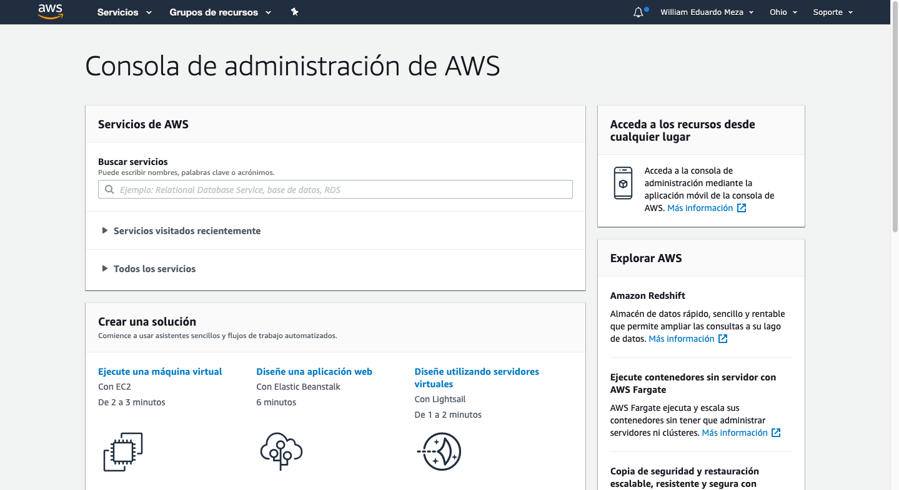
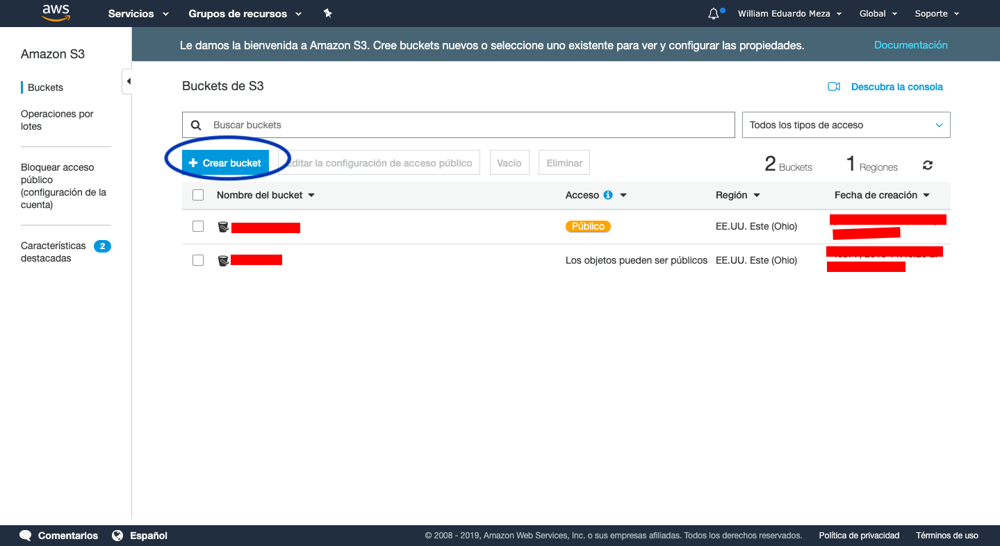
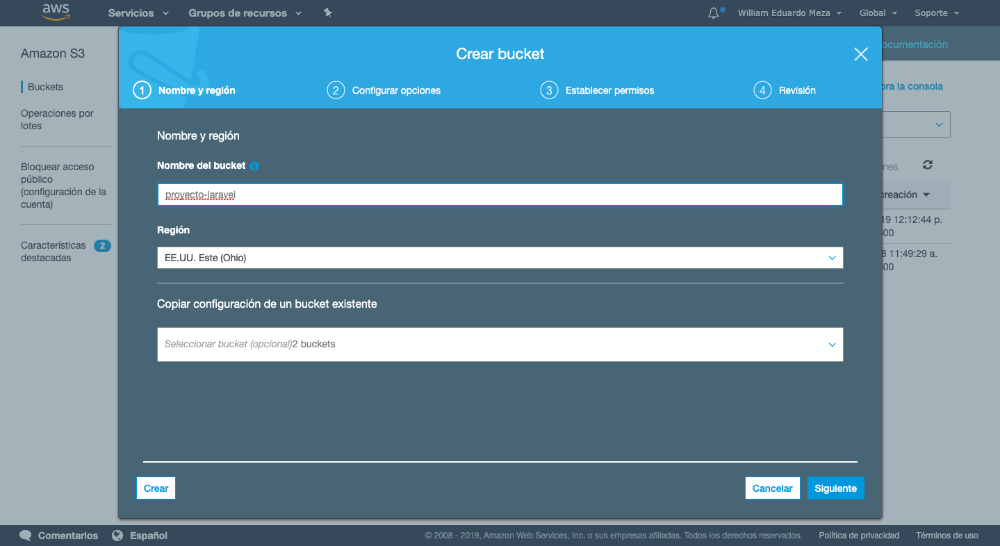
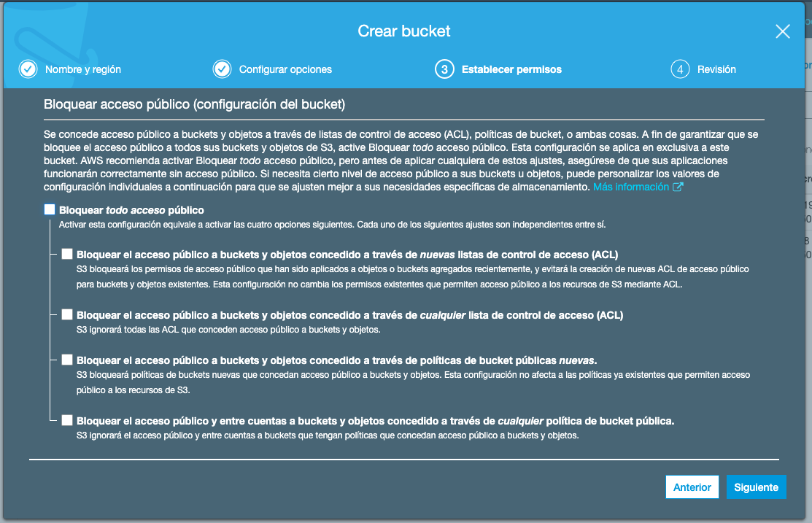
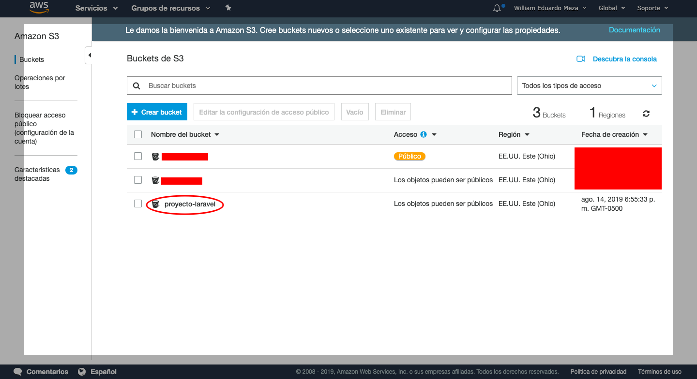
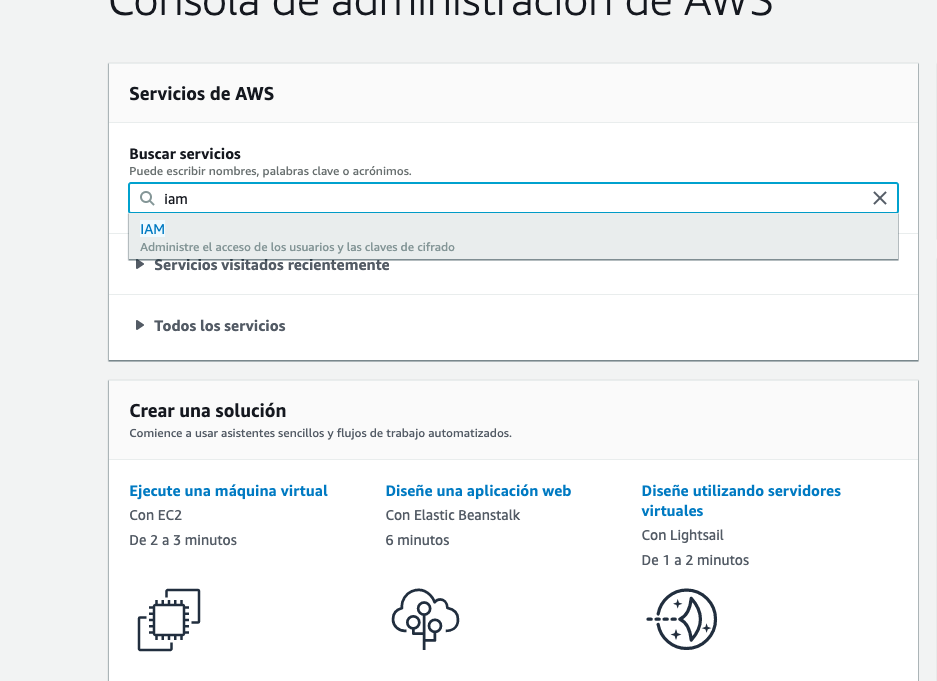
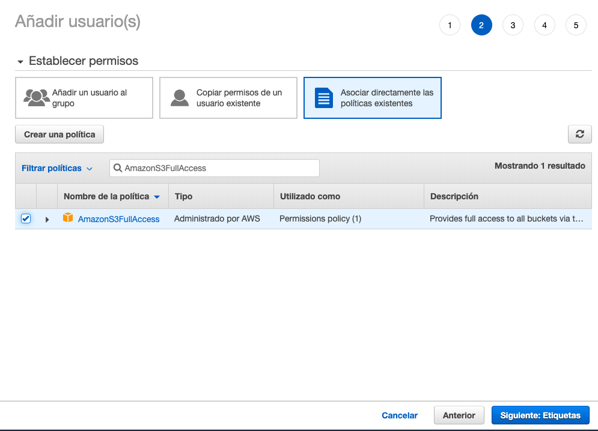
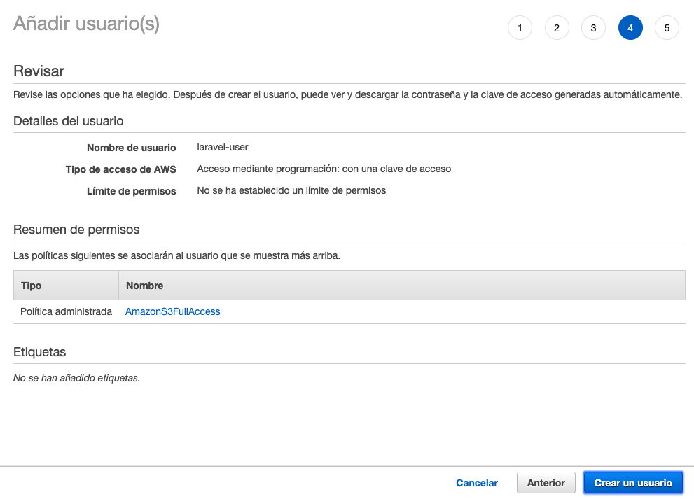
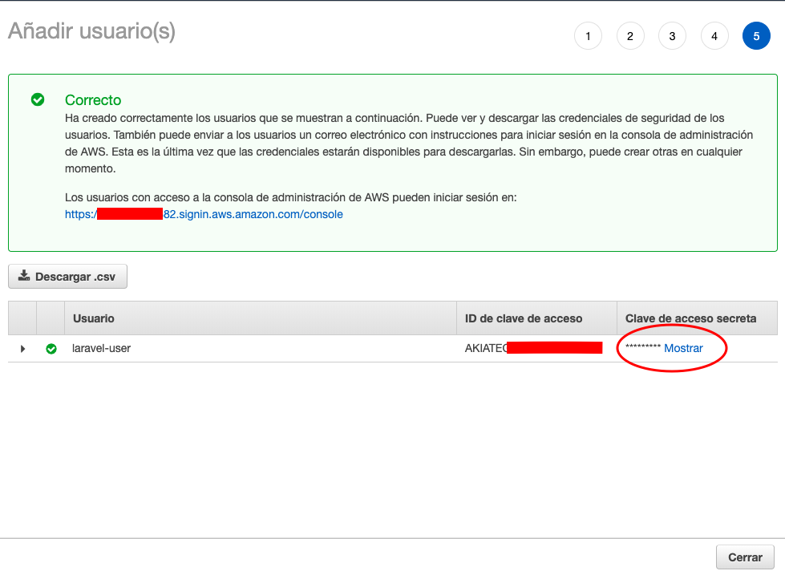

Este es un paso a paso para configurar Laravel storage desde la versión 5, para usar el driver de AWS S3.

Antes de empezar se necesita tener una cuenta en AWS, asi que arrancaremos desde allí hasta configurar el driver

1. Lo primero que debemos hacer es acceder a la [consola AWS](https://console.aws.amazon.com/). Si ya tienes una cuenta, puedes iniciar sesión, si no, debes hacer click en **Crear una cuenta de AWS**, llenar paso a paso el formulario, deberás tener una tarjeta de crédito y una cuenta de correo electrónico.

Hasta cierto punto (bajo consumo) AWS S3 puede ser prácticamente gratis, pero lo mejor será que ingreses en la zona de facturación (billing) y agregues una tarjeta de crédito. Respecto al cálculo del costo, como es por consumo, eso puede llevar a otro [tutorial](http://www.maestrosdelweb.com/por-que-utilizar-s3-el-sistema-de-almacenamiento-de-amazon/).

2. **Crear un Bucket** después de haber iniciado sesión tendremos un dashboard (como el que se incluyen en la imágen de abajo), podemos rápidamente usar la buscador de servicios (barra de búsqueda) con la palabra **S3** o navegando en el panel.

Una vez dentro del servicio de **AWS S3** vamos a crear un **bucket**, es un contenedor de objectos, en el que podemos almacenar de todo. Para nuestro caso serán archivos y los administraremos con nuestro servicio de Laravel.
Podemos tener buckets públicos, privados y con permisos de acceso. También un bucket privado y algún objeto público

3. 

4. 

5. 

6. 
Para este caso desactivaremos el bloquear todo acceso público, esto significa que los archivos serán públicos.

7. 

8. 

9. **Crear un usuario en IAM** en la página de la consola de AWS, seleccionamos el servicio **IAM** podemos buscarlos en la barra de búsqueda.


10. En la barra lateral izquierda, seleccionamos «Usuarios» y en la página de usuarios Hacemos clic en «Agregar usuario»


11. Seleccionamos el tipo de acceso mediante programación solamente, solo queremos que este usuario pueda acceder de forma programática.


12. Para este ejemplo estableceremos políticas de full acceso solamente para el servicio de S3. Las políticas de acceso se pueden hacer muy personalizadas para mantener la integridad y seguridad independiente para cada servicio.


13. Este paso es opcional, podemos saltarnos esta parte, continuar nuestro proceso y aws se encargará por nosotros.


14. Con esto ya estaríamos listos para finalizar el proceso.


15. Descargar nuestras **nuevas credenciales**

16. **Finalmente** ya podemos usar el driver de S3 para Laravel 5 con el bucket y las credenciales que creamos, solo debemos colocar estos valores en nuestro archivo de entorno (.env) de nuestro proyecto en Laravel:

Si quieres saber cómo configurar Laravel para empezar a usar el driver de S3 lo mejor es revisar la propia [documentación](https://laravel.com/docs/5.8/filesystem#driver-prerequisites).

Como bonus:

Probablemente no tengas alojado tu proyecto Laravel dentro de AWS y requieres habilitar CORS. Para esto deberás ingresar los siguientes valores en tu bucket:

```xml
<CORSConfiguration xmlns="http://s3.amazonaws.com/doc/2006-03-01/">
<CORSRule>
    <AllowedOrigin>*</AllowedOrigin>
    <AllowedMethod>GET</AllowedMethod>
    <MaxAgeSeconds>3000</MaxAgeSeconds>
</CORSRule>
</CORSConfiguration>
```

