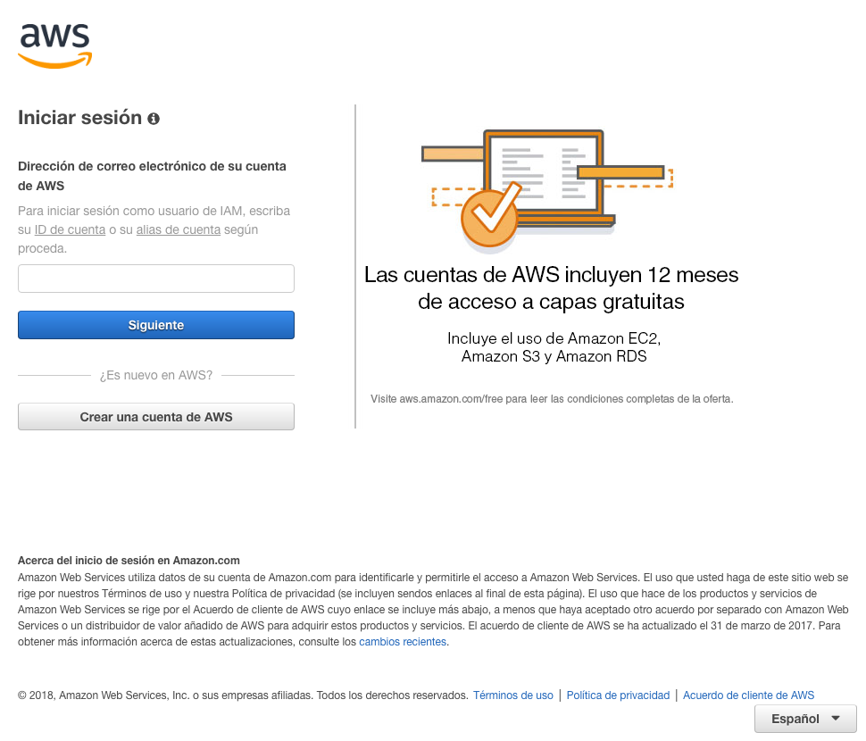
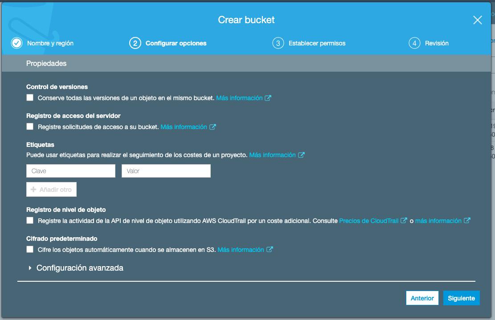
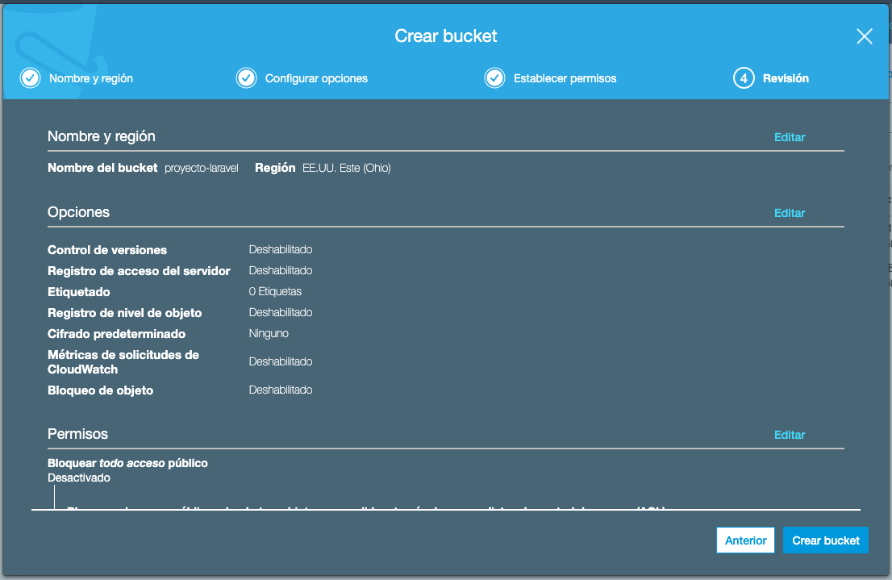
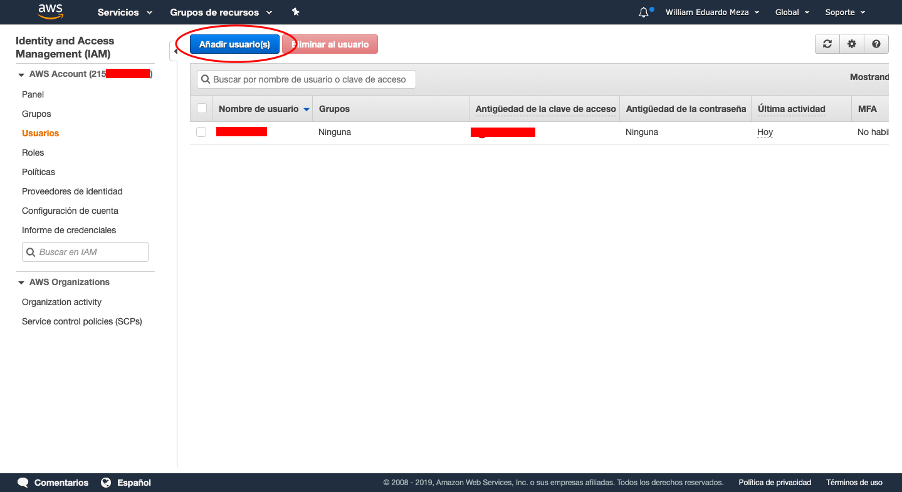
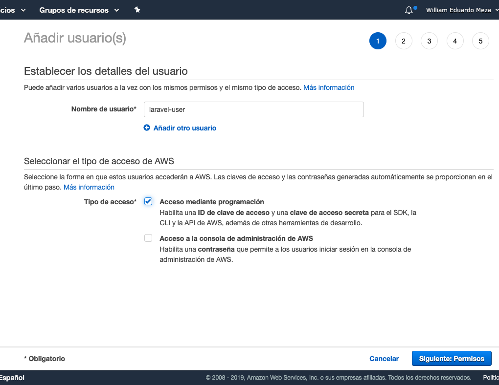
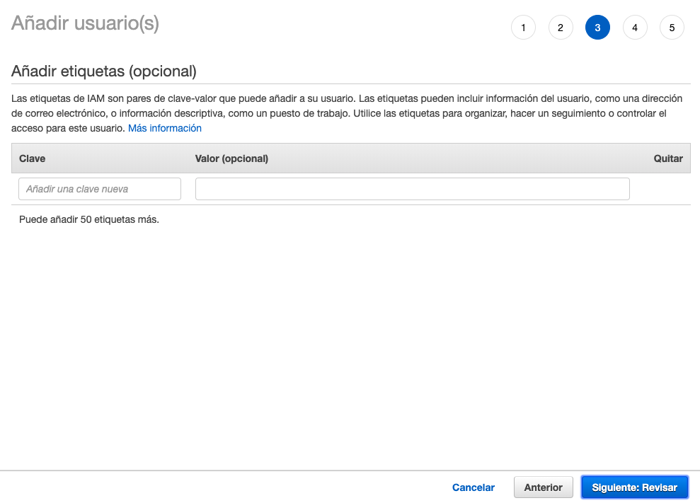
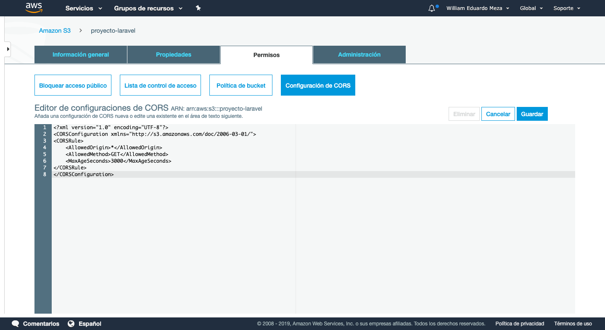

This is a step by step to configure Laravel storage from version 5, to use AWS S3 driver.

Before starting you need to have an AWS account, so we will start from there registering to configuring the S3 driver

1. The first thing we must do is access the [console AWS](https://console.aws.amazon.com/). If you already have an account, you can log in, if not, you must click on **Create an AWS account**, fill out the form step by step, you must have a credit card and an email account.

To a certain extent (low consumption) AWS S3 can be practically free, but it will be best if you enter the billing area and add a credit card. Regarding the calculation of cost, as it is for consumption, that can lead to another [tutorial](http://www.maestrosdelweb.com/por-que-utilizar-s3-el-sistema-de-almacenamiento-de-amazon/).

2. **Create a Bucket** after logging, inside the dashboard (like the one included in the image below), we can quickly use the search engine with the word **S3** or by browsing on the panel.

Once inside the **AWS S3** service, we are going to create a **bucket**, it is an object container, in which we can store everything. In our case, they will be files and we will manage them with our Laravel service.
We can have public, private and access permission buckets. Also a private bucket and some public object

3. 

4. 

5. 

6. 
In this case we will disable blocking all public access, this means that the files will be public.

7. 

8. 

9. **Create a user in IAM** on the AWS console page, select the service **IAM** we can search for them in the search bar.


10. In the left sidebar, select «Users» and in the users page click on «Add user».


11. Select the type of access programmatically only, we just want this user to be able to access it programmatically.


12. For this example we will establish full access policies only for the S3 service. Access policies can be customized to maintain integrity and security independent for each service.


13. This step is optional, we can skip this part, continue our process and aws will take care of us.


14. Now this we would be ready to finish the process.


15. Download our **new credentials**


16. **Finally** we ready to use the S3 driver for Laravel 5 with the bucket and credentials that we have created, we just have to put these values in our environment file (.env) of our project in Laravel:

If you want to know how to configure Laravel to start using the S3 driver, it is best to check your own [documentation](https://laravel.com/docs/5.8/filesystem#driver-prerequisites).

As a bonus:

You probably don't have your Laravel project hosted within AWS and you need to enable CORS. For this case you must enter the following values in your bucket:

```
<pre class="EnlighterJSRAW" data-enlighter-group="" data-enlighter-highlight="" data-enlighter-language="generic" data-enlighter-linenumbers="" data-enlighter-lineoffset="" data-enlighter-theme="" data-enlighter-title=""><?xml version="1.0" encoding="UTF-8"?>
<CORSConfiguration xmlns="http://s3.amazonaws.com/doc/2006-03-01/">
<CORSRule>
    <AllowedOrigin>*</AllowedOrigin>
    <AllowedMethod>GET</AllowedMethod>
    <MaxAgeSeconds>3000</MaxAgeSeconds>
</CORSRule>
</CORSConfiguration>
```

