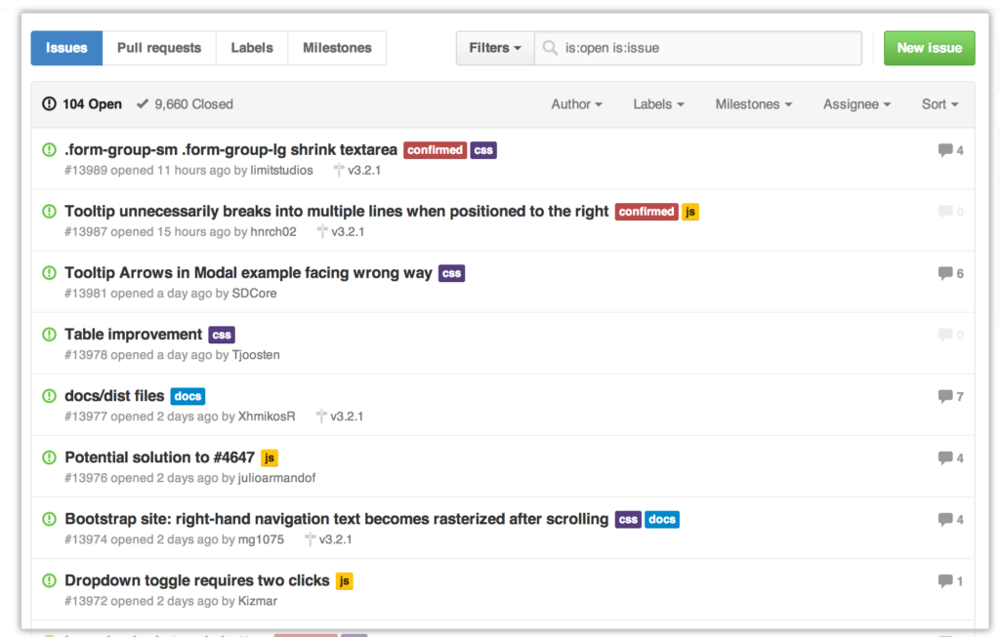

Good commits are well documented and allow you to understand the chronology of the project at a glance and thus facilitate the search. This is why GitHub allows us to commit issues within the message of a commit Did you know that you can close an issue in a commit? You can also mention users and even other commits.

To mention or **referencing a user** within a commit, just type `@username` (with username we want to mention)

```
@jhon collaborated in this part.
```

To **mention an issue**, a hashtag is used followed by an id: `#issue_id`

```
trying to fix issue #33.
```

Also, **you can close an issue** inside a commit using the keywords:  
`close closes closed fix fixes fixed resolve resolves resolved`
It is a good practice to write commit messages in English to be consistent with the keywords.
So for example if the commit does not solve the problem but it is decided to close the commit, it is understood to use the keywords' close, closes or closed ', if the issue is a bug and the commit solves the error it would be better to use the keywords' fix, fixes or fixed 'and if it is a required improvement you can use' resolve, resolves or resolved '. all keywords also close the referenced issue.

In case of being an issue to close:

```
This Closes #123
```

If you want to **close an issue from an external repository** we must use this syntaxis: `username/repository#issue_id`, for example:

```
This Closes example_user/example_repo#76
```

Additionally, you can **close multiples issues** in the same commit (maybe is not good choice for every case)

```
This closes #34, closes #23, and closes example_user/example_repo#42
```

Finally,  you can reference **or metion another commit** using the md5 hash id  

```
e87947412f9b80d1c89e71541f8322a822301245 also works and it's similar to this.
```

BONUS:

How about we add emotion to the commit?, we can also use **emojis inside the messages** of the commit using `:emoji:`  
To see all the available emojis you can go to [Emoji cheat sheet](https://www.webpagefx.com/tools/emoji-cheat-sheet/).

There are many things we can do with git and github but relating using commits has helped me a lot. I hope it is useful to you as well.

### Update:

This post also applies if you use Gitlab, you can go to the [gitlab documentation](https://docs.gitlab.com/ee/user/project/issues/closing_issues.html) and learn more tricks.